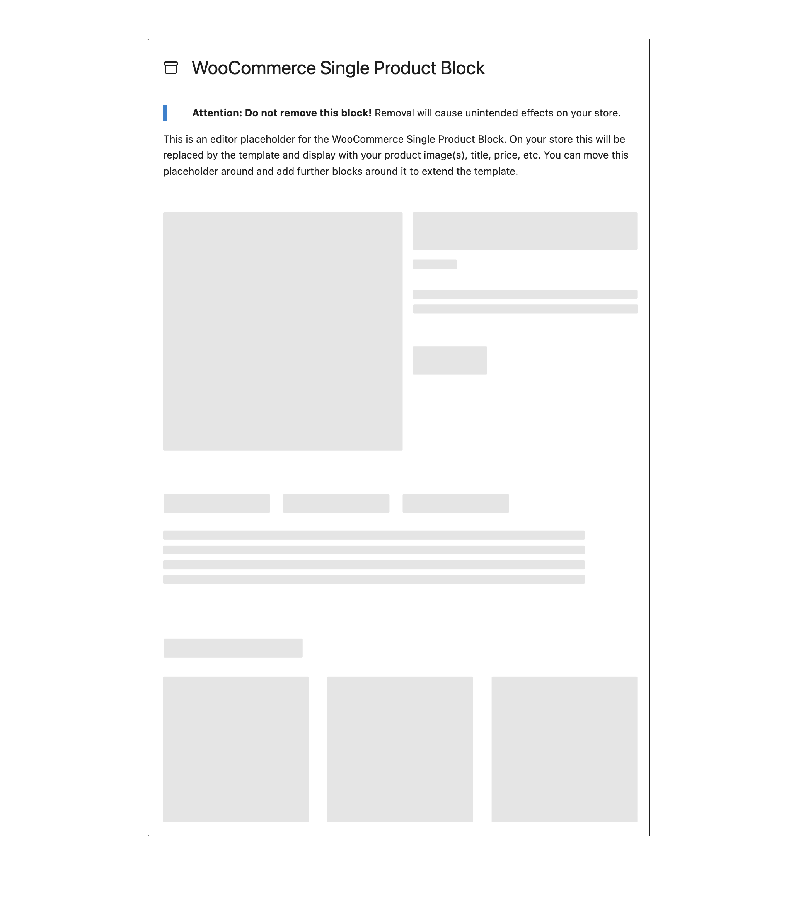

# 📣 Announcement: New documentation location

The documentation for WooCommerce Blocks has moved to the [WooCommerce monorepo](https://github.com/woocommerce/woocommerce/tree/trunk/plugins/woocommerce-blocks/docs/).

Please refer to the documentation in the new location as the files in this repository will no longer be updated and the repository will be archived.

---

# Classic Template Block <!-- omit in toc -->

## Table of Contents <!-- omit in toc -->

-   [Usage](#usage)
    -   [Props](#props)

The Classic Template block is a placeholder block for specific WooCommerce block templates which are rendered on the server-side when a block theme is active.

By assigning a template identifier to the attribute prop, the block will render that specific template on the front-end, and a placeholder for said template in the Site Editor.

It's worth noting that the placeholder in the Site Editor is merely an approximate representation of a template's front-end view.

## Usage

This block does not have any customizable options available, so any style or customization updates will not be reflected on the placeholder.

### Props

-   `attributes`
    -   `template`: `single-product` | `archive-product` | `taxonomy-product_cat` | `taxonomy-product_tag` | `taxonomy-product_attribute`
    -   `align`: `wide` | `full`

```html
<!-- wp:woocommerce/legacy-template {"template":"single-product"} /-->
```



<!-- FEEDBACK -->

---

[We're hiring!](https://woocommerce.com/careers/) Come work with us!

🐞 Found a mistake, or have a suggestion? [Leave feedback about this document here.](https://github.com/woocommerce/woocommerce-gutenberg-products-block/issues/new?assignees=&labels=type%3A+documentation&template=--doc-feedback.md&title=Feedback%20on%20./docs/README.md)

<!-- /FEEDBACK -->
