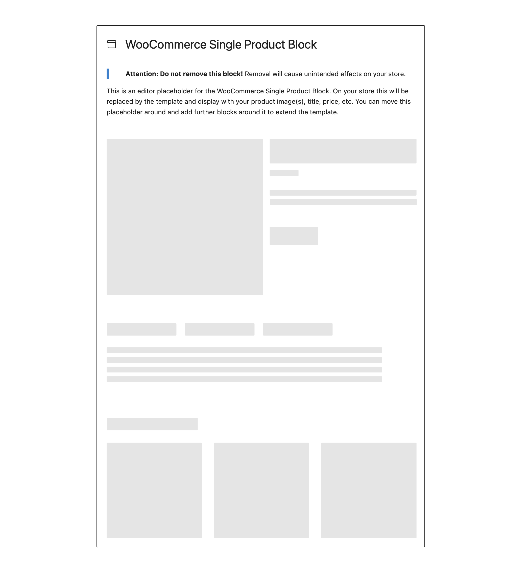

# Classic Template Block

The Classic Template block is a placeholder block for specific WooCommerce block templates which are rendered on the server-side when a block theme is active.

By assigning a template identifier to the attribute prop, the block will render that specific template on the front-end, and a placeholder for said template in the Site Editor.

It's worth noting that in the Site Editor where a placeholder merely represents a front-end view, this representation will not always be completely accurate.

## Usage

This block does not have any customizable options available, so any style or customization updates will not be reflected on the placeholder.

### Props

* `attributes`
  * `template`: `single-product` | `archive-product` | `taxonomy-product_cat` | `taxonomy-product_tag`

```html
<!-- wp:woocommerce/legacy-template {"template":"single-product"} /-->
```


