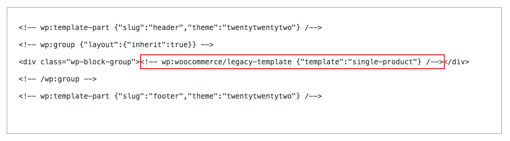

# LegacyTemplate

[Source file](https://github.com/woocommerce/woocommerce-gutenberg-products-block/blob/trunk/src/BlockTypes/LegacyTemplate.php)

The LegacyTemplate is a class used to set up the Legacy Template block on the server-side, and render the correct template.

## Overview

It is from this file we enqueue the frontend scripts necessary for the product gallery, add to basket etc. functionality to work on the frontend.

From the `render()` method we inspect the `$attributes` object for a `template` property which helps determine which core PHP templating code to execute (e.g. `single-product`) for the front-end views.

